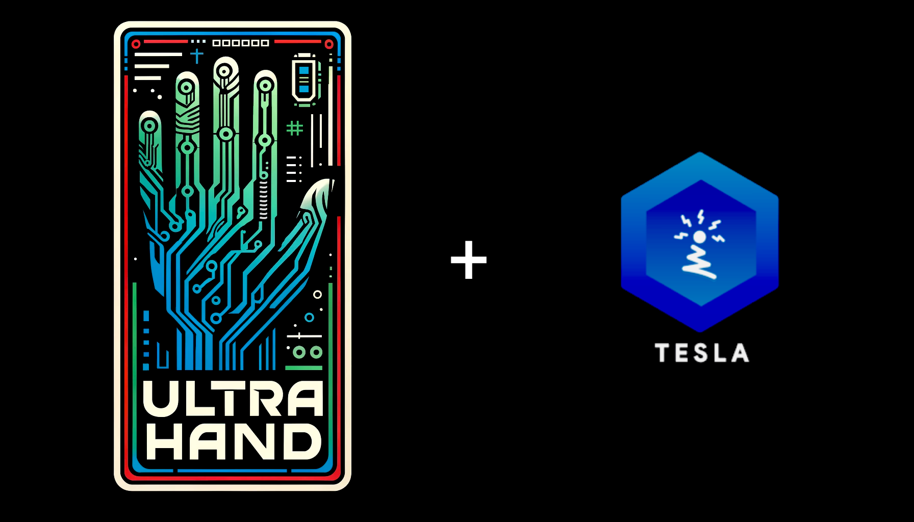

# ☆ libultrahand
[](https://gbatemp.net/forums/nintendo-switch.283/?prefix_id=44)
[](https://github.com/topics/cpp)
[](https://www.gnu.org/licenses/old-licenses/gpl-2.0.en.html)
[](https://github.com/ppkantorski/libultrahand/releases/latest)
[](https://github.com/ppkantorski/libultrahand/graphs/traffic)
[](https://github.com/ppkantorski/libultrahand/issues)
[](https://github.com/ppkantorski/libultrahand/stargazers)


Expanded [**libtesla**](https://github.com/WerWolv/libtesla) (originally by [WerWolv](https://github.com/WerWolv)) + **libultra** libraries for overlay development on the Nintendo Switch



## Compiling

### Necessary Libraries and Imports
For easy importing and inclusion, try using `ultrahand.mk`. These lines must go after your projects `SOURCES` and `INCLUDES` definitions.
```sh
include $(TOPDIR)/lib/libultrahand/ultrahand.mk
```
This location should reflect where you place the `libultrahand` directory (`lib` can vary between projects).

##

Otherwise developers should include the following `SOURCES` and `INCLUDES` lines.
```sh
SOURCES  += lib/libultrahand/common lib/libultrahand/libultra/source
INCLUDES += lib/libultrahand/common lib/libultrahand/libultra/include lib/libultrahand/libtesla/include
```
##

Including the following libraries are also essential for compilation.
```sh
LIBS := -lcurl -lz -lminizip -lmbedtls -lmbedx509 -lmbedcrypto -lnx
```

### Active Services
Service conflictions can occur, so if you are already using the following libnx services, you may want to remove them from your project.
```cpp
i2cInitialize();
fsdevMountSdmc();
splInitialize();
spsmInitialize();
ASSERT_FATAL(socketInitializeDefault());
ASSERT_FATAL(nifmInitialize(NifmServiceType_User));
ASSERT_FATAL(smInitialize()); // needed to prevent issues with powering device into sleep
```
Service `i2cInitialize` however is only utilized in accordance with `USING_WIDGET_DIRECTIVE`.

### Optional Compilation Flags
```
-ffunction-sections -fdata-sections
```
These options are present in both CFLAGS and CXXFLAGS. They instruct the compiler to place each function and data item in its own section, which allows the linker to more easily identify and remove unused code.

```
-Wl,--gc-sections
```
Included in LDFLAGS. This linker flag instructs the linker to remove unused sections that were created by -ffunction-sections and -fdata-sections. This ensures that functions or data that are not used are removed from the final executable.

```
-flto (Link Time Optimization)
```
Present in CFLAGS, CXXFLAGS, and LDFLAGS. It enables link-time optimization, allowing the compiler to optimize across different translation units and remove any unused code during the linking phase. You also use -flto=6 to control the number of threads for parallel LTO, which helps speed up the process.

```
-fuse-linker-plugin
```
This flag allows the compiler and linker to better collaborate when using LTO, which further helps in optimizing and eliminating unused code.
Together, these flags (-ffunction-sections, -fdata-sections, -Wl,--gc-sections, and -flto) ensure that any unused functions or data are stripped out during the build process, leading to a smaller and more optimized final binary.


## Build Examples
- [Ultrahand Overlay](https://github.com/ppkantorski/Ultrahand-Overlay)

- [Tetris Overlay](https://github.com/ppkantorski/Tetris-Overlay)

- [Status Monitor Overlay](https://github.com/ppkantorski/Status-Monitor-Overlay)

- [Edizon Overlay](https://github.com/ppkantorski/EdiZon-Overlay)

- [Sysmodules](https://github.com/ppkantorski/ovl-sysmodules)

- [sys-clk](https://github.com/ppkantorski/sys-clk)

- [FPSLocker](https://github.com/ppkantorski/FPSLocker)

- [ReverseNX-RT](https://github.com/ppkantorski/ReverseNX-RT) 

- [QuickNTP](https://github.com/ppkantorski/QuickNTP)

- [SysDVR Overlay](https://github.com/ppkantorski/sysdvr-overlay)

- [Fizeau](https://github.com/ppkantorski/Fizeau)

- [NX-FanControl](https://github.com/ppkantorski/NX-FanControl)

- [DNS-MITM_Manager](https://github.com/ppkantorski/DNS-MITM_Manager)


## Features

### Overriding Themes and Wallpapers

To customize theme, wallpaper and / or allow direct language translations for your overlay, you can override the default settings by adding the following lines to your `Makefile`:

```
# Enable appearance overriding
UI_OVERRIDE_PATH := /config/<OVERLAY_NAME>/
CFLAGS += -DUI_OVERRIDE_PATH="\"$(UI_OVERRIDE_PATH)\""
```

Replace `<OVERLAY_NAME>` with the desired name of your overlay config directory.

Users can specify custom Ultrahand `theme.ini` and `wallpaper.rgba` files for the overlay to use located in your SD card's `/config/<OVERLAY_NAME>/` or `{UI_OVERRIDE_PATH}` directory.

#### **Troubleshooting**
**Notice:** Makefile directives also must be added to `CXXFLAGS`.
You can do this by adding the directives before `CXXFLAGS := $(CFLAGS)` gets defined, or include `CXXFLAGS += ...`.


There are rare occurences where the theme and wallpaper are still not being loaded.  This may have to do with how the GUI class is used in some projects. For a work around, you can try adding the `INITIALIZE_IN_GUI_DIRECTIVE` directive. 

```
# For theme / wallpaper loading in GUI class method (add to project if theme does not appear)
INITIALIZE_IN_GUI_DIRECTIVE := 1
CFLAGS += -DINITIALIZE_IN_GUI_DIRECTIVE=$(INITIALIZE_IN_GUI_DIRECTIVE)
```

This fix will work for many projects, but other projects may not like this directive or may not need it at all so use with that in mind.

---

### Overriding Languages
For language translation, `UI_OVERRIDE_PATH` must be defined.  Translations are performed direction on the rederer's `drawString` method. Direct strings can be added to a json located in `/config/<OVERLAY_NAME>/lang/` or `{UI_OVERRIDE_PATH}/lang/`.

Jsons will need to be named ISO 639-1 format (en, de, fr, es, etc...) and will only be used in accordance with the current language set in the Ultrahand Overlay `/config/ultrahand/config.ini`.

The format for language jsons is as follows.
```json
{
  "English String": "Translated String",
  "Another String": "Another Translation",
  ...
}
```

---

### Ultrahand Overlay Widget

To add the Ultrahand Overlay widget to your `OverlayFrame`'s, add the following directive to your `Makefile`:

```
# Enable Widget
USING_WIDGET_DIRECTIVE := 1 
CFLAGS += -DUSING_WIDGET_DIRECTIVE=$(USING_WIDGET_DIRECTIVE)
```

---

### Forcing use of `<fstream>` instead of `<stdio.h>` (unnecessary)

To compile utilizing `fstream`, add the following directive to your `Makefile`:

```
# Enable fstream
USING_FSTREAM_DIRECTIVE := 1 
CFLAGS += -DUSING_FSTREAM_DIRECTIVE=$(USING_FSTREAM_DIRECTIVE)
```

---

### Initializing Settings

Ultrahand Overlay theme variables and settings for your overlay are read automatically upon initialization.  Themes loading implementation is currently set within `OverlayFrame` and `HeaderOverlayFrame`.  

However if you are breaking your project up into individual parts that only import `tesla.hpp` and modify elements, you may need to declare `/libultrahand/libultra/include` at the start of your `INCLUDES` in your make file.

If that still is not working, then you may need to add this line somewhere for the theme to be applied to that element.

```cpp
tsl::initializeThemeVars(); // Initialize variables for ultrahand themes
```

### Download Methods

To utilize the `libultra` download methods in your project, you will need to add the following line to your `initServices` function:
```cpp
initializeCurl();
```
As well as the following line to your `exetServices` function:
```cpp
cleanupCurl();
```

These lines will ensure `curl` functions properly within the overlay.


## Contributing

Contributions are welcome! If you have any ideas, suggestions, or bug reports, please raise an [issue](https://github.com/ppkantorski/libultrahand/issues/new/choose), submit a [pull request](https://github.com/ppkantorski/libultrahand/compare) or reach out to me directly on [GBATemp](https://gbatemp.net/threads/ultrahand-overlay-the-fully-craft-able-overlay-executor.633560/).

[](https://ko-fi.com/X8X3VR194)

## License

This project is licensed and distributed under [GPLv2](LICENSE) with a [custom library](libultra) utilizing [CC-BY-4.0](SUB_LICENSE).

Copyright (c) 2024 ppkantorski
