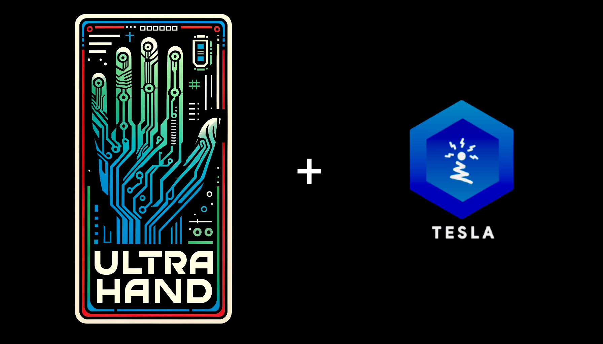

# ☆ libultrahand
[](https://gbatemp.net/forums/nintendo-switch.283/?prefix_id=44)
[](https://github.com/topics/cpp)
[](https://www.gnu.org/licenses/old-licenses/gpl-2.0.en.html)
[](https://github.com/ppkantorski/libultrahand/releases/latest)
[](https://github.com/ppkantorski/libultrahand/graphs/traffic)
[](https://github.com/ppkantorski/libultrahand/issues)
[](https://github.com/ppkantorski/libultrahand/stargazers)

An expanded fork of [**libtesla**](https://github.com/WerWolv/libtesla) (originally by [WerWolv](https://github.com/WerWolv)) combined with the **libultra** utility library — a comprehensive foundation for Nintendo Switch overlay development.



---

## Features

### Rendering & UI
- Fully anti-aliased rendering — rounded rects, uniform rounded rects, bordered rounded rects, and circles
- Global alpha limiter for smooth show/hide transitions and glyph rendering
- Rewritten `List` class with `jumpToItem`, proper wall handling, and no pointer caching
- `TrackBar` and `TrackBarV2` with touch support, click animations, and haptic feedback
- `ToggleListItem`, `CategoryHeader` (with right-side value display), and other standard UI elements
- `OverlayFrame` / `HeaderOverlayFrame` with auto-scrolling titles and subtitles
- `swapTo` page navigation with crash-safe rapid input handling
- Font Manager with universal glyph cache and full multi-language glyph support
- Smooth list item text scrolling, shake-highlight at list boundaries

### Theming & Appearance
- Full `theme.ini` system with extensive color variables covering every UI surface
- Per-overlay theme overrides via `UI_OVERRIDE_PATH` — scoped to `/config/<OVERLAY_NAME>/`
- Wallpaper support (`.rgba`, 448×720 px) with heap-aware loading and optimized rendering
- Status bar widget — clock, temperature, battery, backdrop, and border (opt-in via `USING_WIDGET_DIRECTIVE`)

### Language & Localization
- Automatic string translation at render time via `drawString`
- Per-overlay language files (ISO 639-1 JSON) in `/config/<OVERLAY_NAME>/lang/`
- All language font glyphs accessible regardless of the active system language

### Sound & Haptics
- WAV sound effect playback (8–48 kHz, 16-bit PCM) via libnx `audout`, with volume control
- Sound and haptics each run on dedicated background threads for reliability and performance
- Haptic rumble patterns for click and double-click feedback

### Notifications
- Multi-slot toast notification system (up to 8 concurrent; 4 on 4MB heap)
- JSON-based API notifications written to `/config/ultrahand/notifications/` by any app
- Optional notification icons (50×50 RGBA), titles, timestamps, duration, alignment, and font size
- Per-app notification filtering via flag files; API toggle hotkey for live enable/disable
- `tsl::notification->show` and `tsl::notification->showNow` for queued and immediate display

### Input
- Full touch support alongside controller input — tap, hold, swipe, and drag
- Configurable per-item touch, hold, and release behavior on `ListItem`
- `tsl::shiftItemFocus` for programmatic focus control

### Network & Downloads
- curl-based file downloads with retry logic and NTP auto-sync for SSL reliability
- Internet access verification before initiating downloads
- Per-download socket init/exit to minimize memory pressure

### libultra Utilities
- **File & path** — copy, move, delete, mkdir, wildcard matching, directory traversal, dot-clean
- **INI** — full read/write, section and key management, pattern-matched bulk edits
- **JSON** — read/write via cJSON (migrated from jansson)
- **Hex** — binary file editing by offset, swap, string, decimal, reversed decimal, and custom pattern
- **Strings** — trim, split, format, version parsing, placeholder resolution
- **Lists** — file-backed list reading, set operations, filtering
- **Mod conversion** — `.pchtxt` to `.ips` or Atmosphere cheat format (with `@disabled` flag support)
- **Debug** — thread-safe timestamped logging

### Compatibility & Integration
- Full drop-in replacement for libtesla — all existing Tesla overlays work without modification
- All overlays act as combo launchers for any overlay registered in Ultrahand's `overlays.ini`
- Launch Recall — combo re-entry returns to the exact overlay/package previously launched
- Unsupported overlay warning when launching overlays compiled against incompatible AMS versions

---

## Build Examples

A growing ecosystem of libultrahand-based overlays, all launchable and manageable directly from [Ultrahand Overlay](https://github.com/ppkantorski/Ultrahand-Overlay):

| Overlay | Description |
|---|---|
| [Ultrahand Overlay](https://github.com/ppkantorski/Ultrahand-Overlay) | Fully scriptable overlay menu ecosystem — the primary libultrahand reference implementation |
| [Status Monitor](https://github.com/ppkantorski/Status-Monitor-Overlay) | Real-time CPU/GPU/RAM, temps, battery, and frequency stats |
| [sys-clk](https://github.com/ppkantorski/sys-clk) | Per-game CPU/GPU/memory overclocking and underclocking |
| [FPSLocker](https://github.com/ppkantorski/FPSLocker) | Custom FPS targets and display refresh rates for retail games |
| [Fizeau](https://github.com/ppkantorski/Fizeau) | Color temperature, saturation, gamma, and contrast adjustment |
| [ovl-sysmodules](https://github.com/ppkantorski/ovl-sysmodules) | Toggle system modules and monitor memory usage on the fly |
| [QuickNTP](https://github.com/ppkantorski/QuickNTP) | One-tap NTP time sync |
| [NX-FanControl](https://github.com/ppkantorski/NX-FanControl) | Custom fan curve control |
| [Tetris](https://github.com/ppkantorski/Tetris-Overlay) | Fully playable Tetris running as an overlay |
| [ReverseNX-RT](https://github.com/ppkantorski/ReverseNX-RT) | Per-game handheld/docked mode switching |
| [SysDVR](https://github.com/ppkantorski/sysdvr-overlay) | SysDVR stream control overlay |
| [EdiZon](https://github.com/proferabg/EdiZon-Overlay) | In-game cheat and save editor |
| [DNS-MITM Manager](https://github.com/ppkantorski/DNS-MITM_Manager) | DNS-based network filtering management |

---

## Compiling

### Adding libultrahand to Your Project

The easiest way is to use `ultrahand.mk`. Add this after your `SOURCES` and `INCLUDES` definitions, adjusting the path to where you placed `libultrahand`:

```sh
include $(TOPDIR)/lib/libultrahand/ultrahand.mk
```

Alternatively, add these manually:

```sh
SOURCES  += lib/libultrahand/common lib/libultrahand/libultra/source
INCLUDES += lib/libultrahand/common lib/libultrahand/libultra/include lib/libultrahand/libtesla/include
```

### Required Libraries

```sh
LIBS := -lcurl -lz -lminizip -lmbedtls -lmbedx509 -lmbedcrypto -lnx
```

### Services

libultrahand initializes the following libnx services. If your project already initializes any of these, remove the duplicates to avoid conflicts:

```cpp
fsdevMountSdmc();
splInitialize();
spsmInitialize();
ASSERT_FATAL(socketInitializeDefault());
ASSERT_FATAL(nifmInitialize(NifmServiceType_User));
ASSERT_FATAL(smInitialize());
```

`i2cInitialize()` is only used when `USING_WIDGET_DIRECTIVE` is enabled.

For `libultra` download methods, also call these in your service init/exit:

```cpp
initializeCurl();   // in initServices()
cleanupCurl();      // in exitServices()
```

---

## Makefile Directives

### Theme & Wallpaper Override
Scope a `theme.ini` and `wallpaper.rgba` to your overlay:

```makefile
UI_OVERRIDE_PATH := /config/<OVERLAY_NAME>/
CFLAGS   += -DUI_OVERRIDE_PATH="\"$(UI_OVERRIDE_PATH)\""
CXXFLAGS += -DUI_OVERRIDE_PATH="\"$(UI_OVERRIDE_PATH)\""
```

If the theme still doesn't appear, add the `INITIALIZE_IN_GUI_DIRECTIVE` as a fallback:

```makefile
INITIALIZE_IN_GUI_DIRECTIVE := 1
CFLAGS   += -DINITIALIZE_IN_GUI_DIRECTIVE=$(INITIALIZE_IN_GUI_DIRECTIVE)
CXXFLAGS += -DINITIALIZE_IN_GUI_DIRECTIVE=$(INITIALIZE_IN_GUI_DIRECTIVE)
```

### Language Translations
Requires `UI_OVERRIDE_PATH`. Place ISO 639-1 named JSON files in `/config/<OVERLAY_NAME>/lang/`:

```json
{
  "English String": "Translated String",
  "Another String": "Another Translation"
}
```

Translation is applied automatically on every `drawString` call based on the active Ultrahand language setting.

### Status Bar Widget
```makefile
USING_WIDGET_DIRECTIVE := 1
CFLAGS   += -DUSING_WIDGET_DIRECTIVE=$(USING_WIDGET_DIRECTIVE)
CXXFLAGS += -DUSING_WIDGET_DIRECTIVE=$(USING_WIDGET_DIRECTIVE)
```
Note: this activates `i2cInitialize()` — remove it from your own service init if present.

### Optimization Directives
```makefile
# ~20KB smaller binary via linker-level exception interception (include <exception_wrap.hpp> in main.cpp)
CFLAGS   += -DUSE_EXCEPTION_WRAP=1
LDFLAGS  += -Wl,-wrap,__cxa_throw -Wl,-wrap,_Unwind_Resume -Wl,-wrap,__gxx_personality_v0

# Apply -O3 to rendering components only
CFLAGS   += -DTESLA_TARGETED_SPEED

# Apply -Os to libultra components only
CFLAGS   += -DULTRA_TARGETED_SIZE
```

### Link-Time Optimization (Recommended)
```makefile
CFLAGS   += -ffunction-sections -fdata-sections -flto
CXXFLAGS += -ffunction-sections -fdata-sections -flto
LDFLAGS  += -Wl,--gc-sections -flto -fuse-linker-plugin
```

These flags place each function and data item in its own section, allowing the linker to strip unused code and produce the smallest possible binary.

---

## Contributing

Contributions are welcome! If you have ideas, suggestions, or bug reports, please open an [issue](https://github.com/ppkantorski/libultrahand/issues/new/choose), submit a [pull request](https://github.com/ppkantorski/libultrahand/compare), or reach out on [GBATemp](https://gbatemp.net/threads/ultrahand-overlay-the-fully-craft-able-overlay-executor.633560/).

[](https://ko-fi.com/X8X3VR194)

---

## License

Licensed under [GPLv2](LICENSE) with a [custom library](libultra) under [CC-BY-4.0](SUB_LICENSE).

Copyright © 2023–2026 ppkantorski
